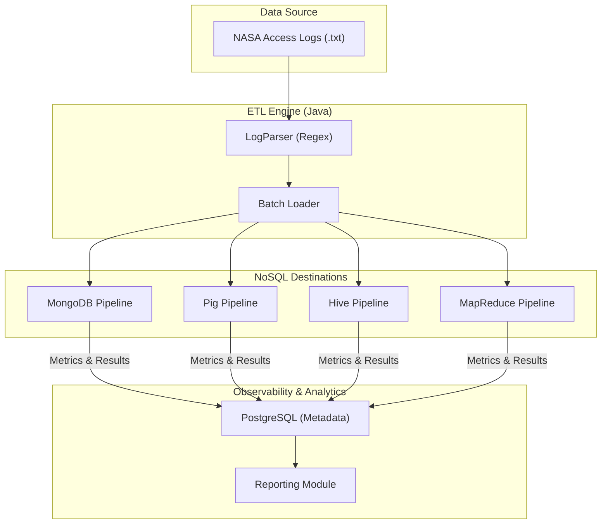

# 🚀 NASA Cosmic Log ETL: A Multi-Engine NoSQL Benchmark

[](https://www.oracle.com/java/)
[](https://www.docker.com/)
[](https://www.postgresql.org/)
[](https://www.mongodb.com/)
[](https://hadoop.apache.org/)
[](https://hive.apache.org/)

## 🌌 The Problem Statement
In the era of modern web-scale applications, processing and analyzing massive HTTP logs (like the historic NASA Kennedy Space Center server logs) presents a significant engineering challenge. Standard relational databases often struggle with the sheer volume and semi-structured nature of raw access logs. 

Engineers need a way to:
- **Efficiently Ingest** millions of log records.
- **Normalize & Parse** varying HTTP request formats.
- **Compare Performance** across different NoSQL and Big Data paradigms (Document Stores vs. MapReduce vs. SQL-on-Hadoop).
- **Generate Real-time Analytics** on traffic patterns, resource usage, and error distributions.

## 🛸 Project Overview
**NASA Cosmic Log ETL** is a comprehensive data engineering project that implements a unified ETL pipeline to process the NASA July/August 1995 HTTP access logs. The system is designed to be **pluggable**, allowing the same data to be processed through four distinct architectural paths, benchmarking their efficiency and reporting capabilities.

### What We Built:
- **Unified Regex Parser**: A robust Java-based parser capable of handling malformed records and extracting host, timestamp, request method, resource path, status code, and response bytes.
- **Multi-Pipeline Architecture**: Seamless integration with **MongoDB**, **Apache Pig**, **Apache Hive**, and **MapReduce**.
- **Observability Layer**: A centralized PostgreSQL metadata store that tracks every execution run, recording batch metrics, parsing failures, and individual query runtimes.
- **Automated Reporting**: A dedicated module that aggregates findings from the NoSQL engines back into a relational format for final executive reporting.

---

## 🛠 Tech Stack
- **Core Logic**: Java 8 (Maven)
- **Primary Database**: PostgreSQL 15 (Metadata & Metrics)
- **NoSQL Engines**: 
  - **MongoDB 6**: Document-oriented storage and aggregation.
  - **Apache Hive 3**: Data warehousing and HQL-based analytics.
  - **Apache Pig 0.17**: Scripting platform for Hadoop data flows.
  - **MapReduce**: Native Hadoop distributed processing.
- **Infrastructure**: Docker & Docker Compose (Containerized ecosystem).

---

## 🏗 System Architecture


---

## 🚦 Getting Started

### 1. Prerequisites
- Docker & Docker Compose
- Java 8 (if running locally without Docker)
- Maven

### 2. Launch the Environment
The entire ecosystem (Postgres, Mongo, Hive) is containerized for easy setup.
```bash
# Clone the repository
git clone <repo-url>
cd nosqlproject

# Spin up the containers
docker compose up -d --build
```

### 3. Run a Pipeline
The system uses interactive containers. You can attach to a specific app container and select your pipeline choice (1-4).

| Container | Command | Choice |
| :--- | :--- | :--- |
| **MongoDB** | `docker attach mongo-app` | Press **1** |
| **Apache Pig** | `docker attach pig-app` | Press **2** |
| **Apache Hive** | `docker attach hive-app` | Press **3** |
| **MapReduce** | `docker attach mr-app` | Press **4** |

### 4. Cleanup
```bash
docker compose down -v
```

---

## 📊 Analytics Generated
For every run, the system computes:
1. **Daily Traffic**: Breakdown of total requests and bytes per day.
2. **Top Resources**: Identification of the most "hit" files/pages and their bandwidth consumption.
3. **Hourly Error Rates**: Tracking 4xx and 5xx errors to identify server instability windows.

Check the `output/` directory or your PostgreSQL `query_metrics` table for the performance results!

---

## 📂 Project Structure
- `src/main/java/Main.java`: The control center for the ETL process.
- `src/main/java/com/nosql/pipelines/`: Implementations for each NoSQL backend.
- `src/main/java/com/nosql/parser/`: Regex-based log parsing logic.
- `docker-compose.yml`: Infrastructure-as-Code for the database cluster.
- `data/nasa_analytics.sql`: SQL schema for metrics and reporting.

---
## 👥 Contributors
- **Rutul Patel** (IMT2022021)
- **Tanish Pathania** (IMT2022049)
- **Mohit Naik** (IMT2022076)
- **Ananthakrishna K** (IMT2022086)

---
**Developed as part of the NoSQL Database Systems Course.** 🚀
